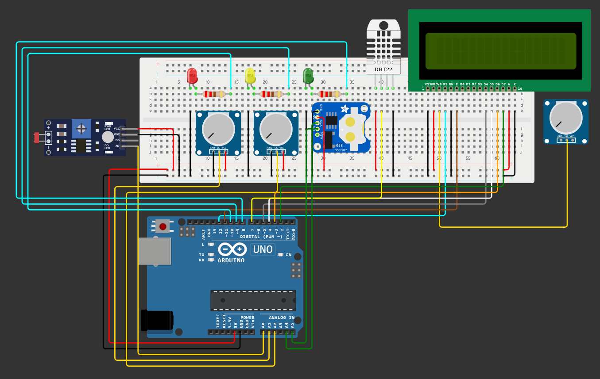

# CoralSense Monitor: Sistema de Monitoramento Avançado para Corais



## Descrição

O CoralSense Monitor é um sistema de monitoramento avançado projetado para fornecer informações precisas sobre o ambiente de corais em aquários. Equipado com sensores de temperatura, luminosidade, pH e índice UV, o CoralSense Monitor oferece uma solução completa para monitorar as condições ideais para o crescimento e saúde dos corais.

## Funcionalidades
- Monitoramento de luminosidade (Lux): Verifica e exibe o nível de luminosidade. Aciona LEDs vermelhos, amarelos ou verdes para indicar níveis críticos, de alerta ou ideais, respectivamente.
- Monitoramento de temperatura: Verifica e exibe a temperatura do ambiente em graus Celsius. Indica se a temperatura está dentro do intervalo ideal.
- Monitoramento de pH (simulação): Verifica e exibe o nível de pH da água. Indica se o pH está dentro do intervalo ideal para corais.
- Monitoramento de índice UV (simulação): Verifica e exibe o índice UV. Indica se o índice UV está em níveis aceitáveis ou críticos.
- Registro de dados: Registra dados críticos na EEPROM para futura consulta. Exibe logs detalhados no terminal serial.
- Exibição em LCD: Mostra todas as informações monitoradas em um display LCD.
- Inicialização com animação: Exibe uma animação inicial no LCD ao ligar o sistema.

## Observações
- As leituras e informações possuem um delay de aproximadamente 10s para evitar sobrecarga de dados
- Este projeto é apenas um protótipo!
- Devido as limitações da plataforma Wokwi, utilizamos potenciômetros para simular os sensores de pH e de raios UV.
- Os sensores utilizados não são os ideais para a proposta de utilizá-los nos ocenaos, por exemplo, seria ideal utilizar ao invés do sensor de temperatura DHT22, um sensor resistente a água como o DS18B20.

## Acesso ao prototipo simulado
<a href="//wokwi.com/projects/399722316556201985" target="_blank" style="text-align: center; margin-right: 10px;">
  

## Vídeo explicativo sobre o prejeto

<a href="### " target="_blank" style="text-align: center; margin-right: 10px;">
  

## Componentes
- Arudino UNO R3;
- Placa de Ensaio (grande);
- Sensor Fotorresistor (LDR);
- DHT22;
- Potenciômetros;
- LEDs;
- Resistores;
- DS1307 RTC (Real Time Clock);
- Tela LCD 16x2;
- Fios

## Instruções de Uso

1. Conecte os sensores de temperatura, luminosidade, pH e índice UV ao CoralSense Monitor.
2. Ligue o dispositivo e aguarde a inicialização.
3. Os dados coletados pelos sensores serão exibidos no display LCD do CoralSense Monitor.
4. Monitore os valores exibidos para garantir que as condições do ambiente dos corais estejam dentro dos parâmetros ideais.

## Requisitos

- Plataforma Wokwi para prototipagem.
- Componentes eletrônicos necessários para montagem do circuito do CoralSense Monitor.
- Conhecimento básico em eletrônica e programação para montagem e configuração do dispositivo.

## Dependências
```
  #include <DHT.h> //Biblioteca para o sensor de temperatura e umidade DHT.
  #include <LiquidCrystal.h> //Biblioteca para controlar displays LCD.
  #include <RTClib.h> //Biblioteca para utilizar módulos RTC (Real-Time Clock).
  #include <Wire.h> //Biblioteca para comunicação I2C.
  #include <EEPROM.h> //Biblioteca para manipulação da memória EEPROM.
```
#### COLABORADORES

<div style="display: flex; justify-content: space-between; align-items: center;">
<a href="https://github.com/AnaTorresLoureiro" target="_blank" style="text-align: center; margin-right: 10px;">

<p style="font-size:min(2vh, 36px); margin-top: 10px;">Ana Laura Torres Loureiro - RM 554375</p>
</a>

<a href="https://github.com/jaoAprendiz" target="_blank" style="text-align: center; margin-right: 10px;">

<p style="font-size:min(2vh, 36px); margin-top: 10px;">João Victor Soave - RM 557595</p>
</a>
</div>

<a href="https://github.com/Vitorr-AF" target="_blank" style="text-align: center; margin-right: 10px;">

<p style="font-size:min(2vh, 36px); margin-top: 10px;">Vitor Augusto França de Oliveira - RM 555469</p>
</a>
</div>

## Tecnologias Utilizadas


