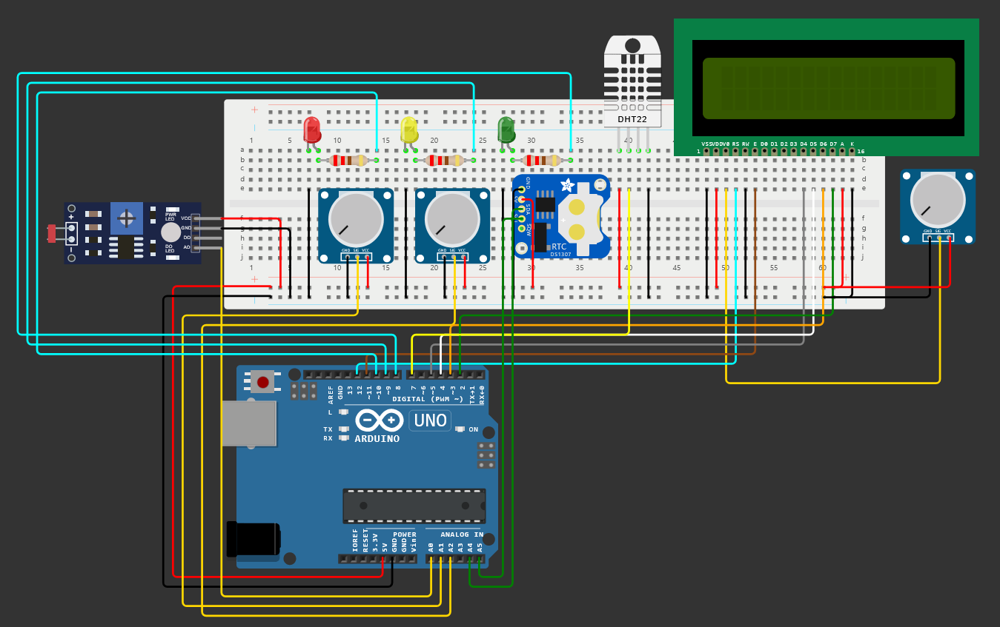

# CoralSense Monitor: Sistema de Monitoramento Avançado para Corais

## Descrição

O CoralSense Monitor é um sistema de monitoramento avançado projetado para fornecer informações precisas sobre o ambiente de corais em aquários. Equipado com sensores de temperatura, luminosidade, pH e índice UV, o CoralSense Monitor oferece uma solução completa para monitorar as condições ideais para o crescimento e saúde dos corais.

## Links
- [Link do Projeto no Wokwi](https://wokwi.com/projects/399722316556201985)
- [Vídeo no Youtube]()

## Instruções de Uso

1. Conecte os sensores de temperatura, luminosidade, pH e índice UV ao CoralSense Monitor.
2. Ligue o dispositivo e aguarde a inicialização.
3. Os dados coletados pelos sensores serão exibidos no display LCD do CoralSense Monitor.
4. Monitore os valores exibidos para garantir que as condições do ambiente do seu aquário de corais estejam dentro dos parâmetros ideais.

## Requisitos

- Plataforma Wokwi para prototipagem.
- Componentes eletrônicos necessários para montagem do circuito do CoralSense Monitor.
- Conhecimento básico em eletrônica e programação para montagem e configuração do dispositivo.

## Dependências

- Bibliotecas necessárias para os sensores utilizados no projeto (por exemplo, DHT para o sensor de temperatura e umidade).

#### COLABORADORES

<a href="https://github.com/AnaTorresLoureiro" target="_blank" style="text-align: center; margin-right: 10px;">

Ana Laura Torres Loureiro - RM 554375

</a>

<a href="https://github.com/jaoAprendiz" target="_blank" style="text-align: center; margin-right: 10px;">

João Victor Soave - RM 557595

</a>

<a href="https://github.com/Vitorr-AF" target="_blank" style="text-align: center; margin-right: 10px;">

Vitor Augusto França de Oliveira - RM 555469

</a>

## Tecnologias Utilizadas

